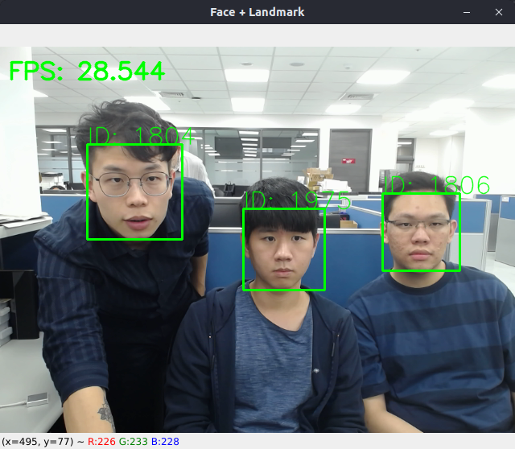
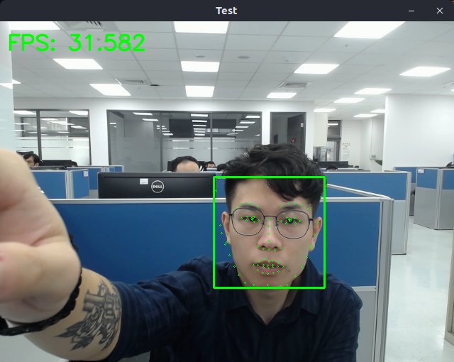

# ngc-fpenet-sample
This is a python sample for face recognition by using opencv face detector and NVIDAI NGC fpenet to get landmark.

## Requirement
* Docker
* nvidia-container

## Environment
```bash
# Build Docker Image
./docker/build.sh

# Activate Docker Container
./docker/run.sh
```

## Workflow
```bash
# Make sure you already in docker container

# Download FPENet
cd /workspace
wget 'https://api.ngc.nvidia.com/v2/models/nvidia/tao/fpenet/versions/deployable_v1.0/files/model.etlt' -O ./model/model.etlt

# Convert Model
./tao-converter-x86 -t fp32 \
-k nvidia_tlt \
-p input_face_images:0,1x1x80x80,1x1x80x80,2x1x80x80 \
-b 1 \
-e /workspace/model/fpenet_b1_fp32.trt \
/workspace/model/model.etlt

# Run Sample
cd /workspace
python3 demo.py -m all -f ./haarcascade_frontalface_default.xml -l ./fpenet_b1_fp32.trt -s /dev/video0
```

## Demo


## Reference
https://forums.developer.nvidia.com/t/how-to-do-inference-with-fpenet-fp32-trt/170909/11

## About Face Detector
https://github.com/opencv/opencv/blob/master/data/haarcascades/haarcascade_frontalface_default.xml

## About NVIDIA FPENet
https://catalog.ngc.nvidia.com/orgs/nvidia/teams/tao/models/fpenet

- Inspect
    ```bash
    $ polygraphy inspect model ./fpenet_b1_fp32.trt --model-type engine


    [I] Loading bytes from /workspace/fpenet_b1_fp32.trt
    [I] ==== TensorRT Engine ====
        Name: Unnamed Network 0 | Explicit Batch Engine (48 layers)
        
        ---- 1 Engine Inputs ----
        {input_face_images:0 [dtype=float32, shape=(-1, 1, 80, 80)]}
        
        ---- 2 Engine Outputs ----
        {softargmax/strided_slice:0 [dtype=float32, shape=(-1, 80, 2)],
        softargmax/strided_slice_1:0 [dtype=float32, shape=(-1, 80)]}
        
        ---- Memory ----
        Device Memory: 15833600 bytes
        
        ---- 1 Profiles (3 Bindings Each) ----
        - Profile: 0
            Binding Index: 0 (Input)  [Name: input_face_images:0]          | Shapes: min=(1, 1, 80, 80), opt=(1, 1, 80, 80), max=(2, 1, 80, 80)
            Binding Index: 1 (Output) [Name: softargmax/strided_slice:0]   | Shape: (-1, 80, 2)    Binding Index: 2 (Output) [Name: softargmax/strided_slice_1:0] | Shape: (-1, 80)
    ```


# TAO Converter
* Resource: https://docs.nvidia.com/tao/tao-toolkit-archive/tao-30-2108/text/tensorrt.html#installing-the-tao-converter
* For x86 docker : 'https://developer.nvidia.com/cuda111-cudnn80-trt72-0'
For Jetson docker :
* JetPack 4.4: 'https://developer.nvidia.com/cuda102-trt71-jp44-0'
* JetPack 4.5: 'https://developer.nvidia.com/tao-converter-jp4.5'
* JetPack 4.6: 'https://developer.nvidia.com/tao-converter-jp4.6'
